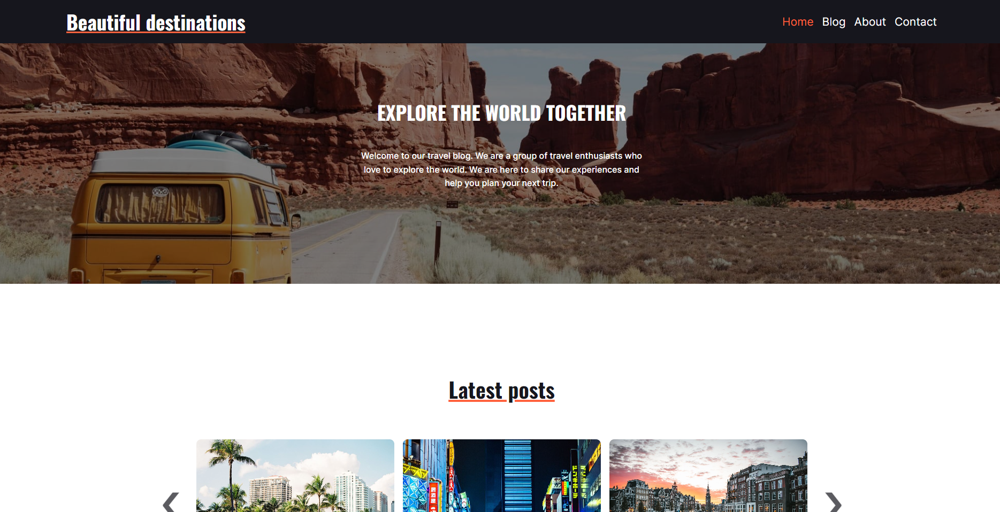

# Beautiful Destinations



CBeautiful Destinations is a captivating travel blog designed to inspire and inform travelers. The blog features engaging articles and stunning visuals, capturing the beauty of various destinations around the world. This website is a school project created for the Front-End Development course at Noroff School of Technology and Digital Media.

## Description

Beautiful Destinations is an online travel blog dedicated to showcasing mesmerizing travel destinations. With a visually pleasing design, the blog presents its audience with engaging articles and eye-catching images. The layout incorporates a clean and modern design to enhance user experience. Featured is a 'Latest Posts' carousel on the home page, creating an interactive element that showcases the most recent articles. The site combines HTML, CSS, and JavaScript for frontend implementation and integrates with WordPress headless CMS REST API for seamless content management. The design is responsive, ensuring an optimal experience across different devices. 

### Key Features

- Engaging Content: The blog features engaging articles that captivate the readers with stories from around the world.

- Visually Pleasing Design: Aesthetically appealing design that combines high-quality images with a clean and modern layout.

- 'Latest Posts' Carousel: An interactive carousel on the home page that features the most recent articles.

- Seamless Content Management: Integration with WordPress for efficient content management.

## Built With

- HTML
- CSS
- JavaScript
- WordPress REST API (Headless CMS)
- Figma (for design)

## Getting Started

### Installing

1. Clone the repo:

```bash
git clone git@github.com:jomolteberg/semester-project-1.git
```

2. Install the dependencies:

```
npm install
```

### Running

To run the app, run the following commands:

```bash
npm run start
```

## Contributing

Contributions are welcome! If you would like to contribute, please fork the repository and make changes as you'd like. Push your changes to your fork and submit a pull request. Please make sure to review your code before submitting.

## Contact

Feel free to contact me:

[LinkedIn](https://www.linkedin.com/in/john-oscar-molteberg-637177180/)
